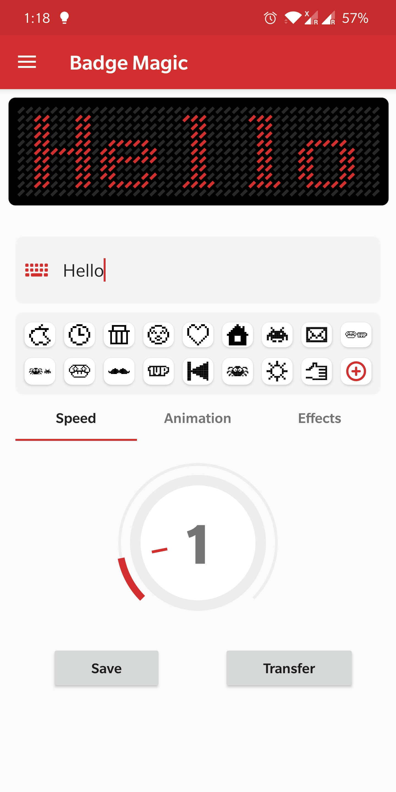
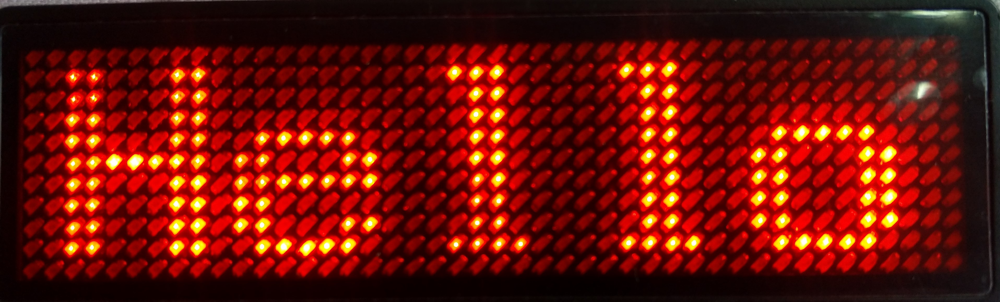
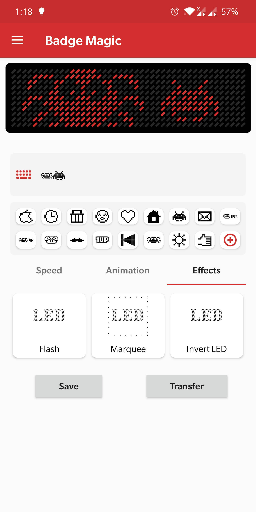
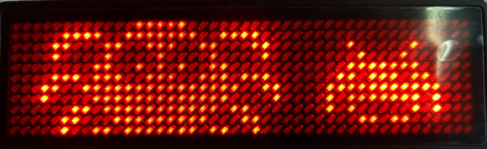
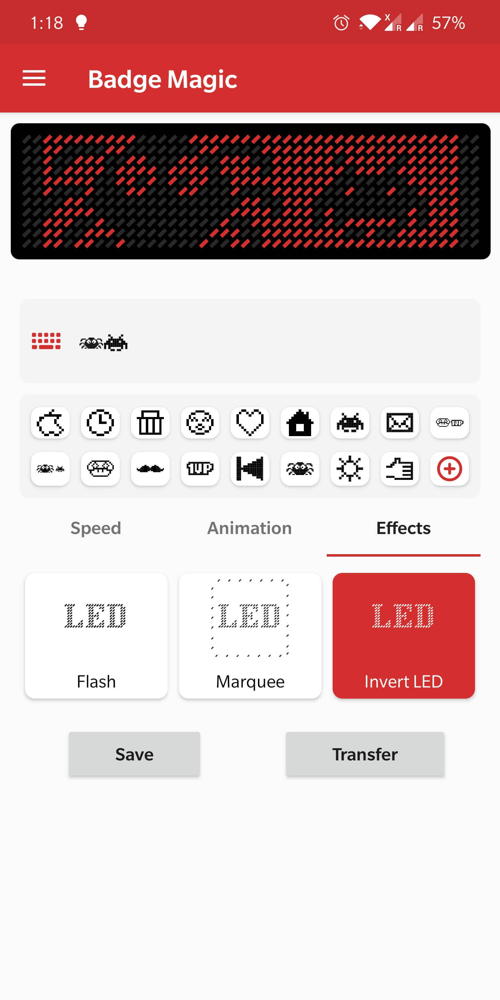
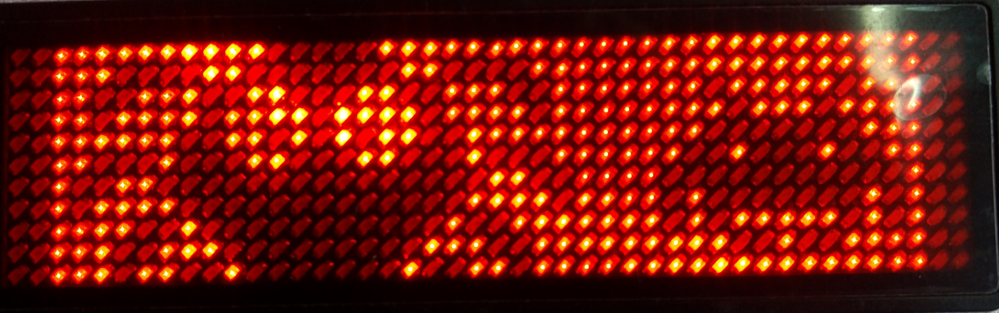

# Badge Magic LED Badge

**Magically Create Text and Draw Cliparts on LED Name Badges using Bluetooth**

The Badge Magic Android app lets you create moving text and draw clipart for LED name badges. The app provides options to portray names, cliparts, and simple animations on the badges. For the data transfer from the smartphone to the LED badge it uses Bluetooth.

| <!-- -->    | <!-- -->    | <!-- -->    |
|-------------|-------------|-------------|
|   |   |   |

## Android

* [Google Playstore](https://play.google.com/store/apps/details?id=org.fossasia.badgemagic)
* [Fdroid](https://f-droid.org/en/packages/org.fossasia.badgemagic/)

## iOS

* [App in iOS store](https://apps.apple.com/us/app/led-badge/id1461761458)

## How to switch on & off, transfer messages to the LED Badge

1. Scan the QR code on the back of the LED badge to access the website. 
2. Choose the right app for you and install it (Android, iOS, Python).
3. Turn on the LED Badge by pressing button as shown in the image.
4. Enable your mobile's Bluetooth. There is no need to pair it with the LED badge, as devices using Bluetooth Low Energy pair automatically.
5. Now open your app and enter your desired message.
6. Turn on the LED badge by pressing the top button on the side of the badge and press again to activate the Bluetooth transfer mode. It will show a Bluetooth image.
7. Click transfer / send on the app to transmit the message.
8. To turn off, press the same button as shown in the image.

Note: The second lower button on the badge is used to switch to different messages, currently available only on the iOS app. We plan to implement this function on the Android app in future.

## Development

* [Android App Code](https://github.com/fossasia/badge-magic-android)
* [iOS App Code](https://github.com/fossasia/badge-magic-iOS)
* [Python App Code](https://github.com/fossasia/led-name-badge-ls32)
* [Badge Magic Firmware](https://github.com/fossasia/badgemagic-firmware)

## Web

* [Visit the website here](https://badgemagic.fossasia.org)
